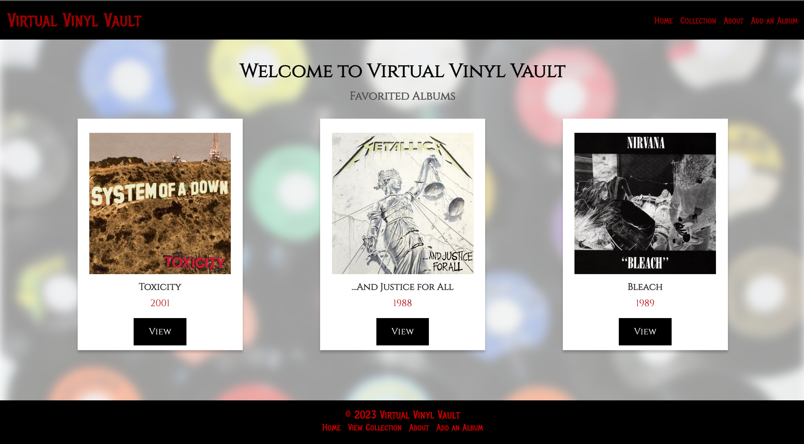

# Digital-Album-Collection
Unit-2-Project

ROUTE TABLE
|       **URL**               | **REST Route** | **HTTP Verb** | **CRUD Action** |   **EJS View(s)**        | **Created Yet?**  |
| --------------------------- | -------------- | ------------- | --------------- | ------------------------ | ----------------- |
| /                           |                | GET           | read            | home.ejs                 | YES               |
| /albums                     | index          | GET           | read            | album-index.ejs            | YES               |
| /albums/:id                 | show           | GET           | read            | album-details.ejs          | YES               |
| /albums/new                 | new            | GET           |                 | album-pet.ejs              | YES               |
| /albums                     | create         | POST          | create          |                          | YES               |
| /albums/:id/edit            | edit           | GET           | read            | edit-album.ejs             | YES               |
| /albums/:id                 | update         | PATCH/PUT     | update          |                          | YES               |
| /albums/:id                 | destroy        | DELETE        | delete          |                          | YES               |
| /comments/                  | index          | GET           | read            | app-index.ejs            | NO                |
| /comments/:id               | show           | GET           | read            | app-details.ejs          | NO                |
| /comments/new/:albumId      | new            | GET           | read            | new-comment.ejs              | NO                |
| /comments/create/:albumId   | create         | POST          | create          |                          | NO                |
| /comments/:id               | destroy        | DELETE        | delete          |                          | NO                |
| /seed                       |                | GET           | delete & create |                          | YES               |
| /about                      |                | GET           |                 | about.ejs                | YES               |
| /*                          |                | GET           |                 | 404.ejs                  | YES               |

## screenshot of the app: 

## Tech used: EJS, MongoDB, Node.js, Express

click link to open app: https://virtual-vinyl-vault-f0611426aaeb.herokuapp.com/

## USER STORIES: 
-As a metalhead I want a place to store information about all my favorite albums and bands.

-As a music collector, I want to visit a music collection website that provides detailed information about rare or limited-edition releases and allows me to showcase my collection to others.

-I need a place to document music in an organized and streamlined fashion. But I want it to be accessible as well.

## WIREFRAMES:

route table:
https://media.git.generalassemb.ly/user/48974/files/8360adc2-c21b-4438-8d36-0d1cd52f41e6